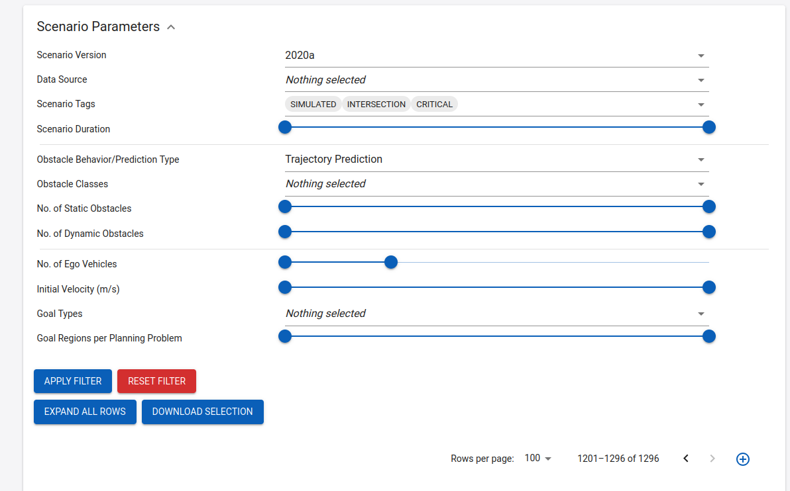

Virtual Enviroment: source ~/.cache/pypoetry/virtualenvs/fiss-plus-planner-zYhukueC-py3.10/bin/activate

FOP: average runtime for  36 steps is  0.8578821818033854 s and have  125.0 trajectories generated and 125.0 trajectories validated and 125.0 collision checks. Average cost is  35.56701852013294  and max cost is  51.57738912417658
FOP+：average runtime for  36 steps is  0.13056284189224243 s and have  125.0 trajectories generated and 1.0 trajectories validated and 1.0 collision checks. Average cost is  35.56701852013294  and max cost is  51.57738912417658
FISS：average runtime for  36 steps is  0.010542869567871094 s and have  7.0 trajectories generated and 1.0 trajectories validated and 1.0 collision checks. Average cost is  35.56701852013294  and max cost is  51.57738912417658
FISS+: average runtime for  36 steps is  0.0238009426328871 s and have  26.0 trajectories generated and 2.0 trajectories validated and 2.0 collision checks. Average cost is  35.462127553942786  and max cost is  51.268934367983256

hiden issues from FISS+ Paper:
1. it compares only 125 path between FOP and FISS+, but if FOP have 500 or 1000 trajectory, the fine calculated solution could have better solution meaning lower cost than FISS+. That is why we need train CVAE-Planner with fine resolution(small dert_d, dert_v_s, dert_t).
  Wenguang: find out the resolution->
2. 

# initial_state = CustomState(position = np.array([best_traj_ego.x[next_step_idx], best_traj_ego.y[next_step_idx]]),
        #                                      velocity = best_traj_ego.ds[next_step_idx],
        #                                      orientation = best_traj_ego.yaw[next_step_idx],
        #                                      yaw_rate = buf_yaw_rate[next_step_idx],
        #                                      time_step = i).convert_state_to_state(InitialState())

Scenario that FOP better than FISS+:
DEU_Lohmar-32_1_T-1.xml (it need accelerate because the car infront)

Set for Scenarios:
