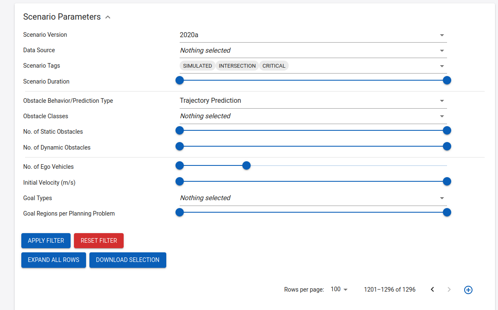

Virtual Enviroment: source ~/.cache/pypoetry/virtualenvs/fiss-plus-planner-zYhukueC-py3.10/bin/activate

FOP: average runtime for  36 steps is  0.8578821818033854 s and have  125.0 trajectories generated and 125.0 trajectories validated and 125.0 collision checks. Average cost is  35.56701852013294  and max cost is  51.57738912417658
FOP+：average runtime for  36 steps is  0.13056284189224243 s and have  125.0 trajectories generated and 1.0 trajectories validated and 1.0 collision checks. Average cost is  35.56701852013294  and max cost is  51.57738912417658
FISS：average runtime for  36 steps is  0.010542869567871094 s and have  7.0 trajectories generated and 1.0 trajectories validated and 1.0 collision checks. Average cost is  35.56701852013294  and max cost is  51.57738912417658
FISS+: average runtime for  36 steps is  0.0238009426328871 s and have  26.0 trajectories generated and 2.0 trajectories validated and 2.0 collision checks. Average cost is  35.462127553942786  and max cost is  51.268934367983256

hiden issues from FISS+ Paper:
1. it compares only 125 path between FOP and FISS+, but if FOP have 500 or 1000 trajectory, the fine calculated solution could have better solution meaning lower cost than FISS+. That is why we need train CVAE-Planner with fine resolution(small dert_d, dert_v_s, dert_t).
  Wenguang: find out the resolution->
2. 

# initial_state = CustomState(position = np.array([best_traj_ego.x[next_step_idx], best_traj_ego.y[next_step_idx]]),
        #                                      velocity = best_traj_ego.ds[next_step_idx],
        #                                      orientation = best_traj_ego.yaw[next_step_idx],
        #                                      yaw_rate = buf_yaw_rate[next_step_idx],
        #                                      time_step = i).convert_state_to_state(InitialState())

Scenario that FOP better than FISS+:
DEU_Lohmar-32_1_T-1.xml (it need accelerate because the car infront)

Set for Scenarios:



# The result of our dataset for collecting scenarios:
Total scenarios with |d_mean| < 0.1: 22683
Total scenarios with |d_mean| >= 0.1: 2027
Selected from |d_mean| < 0.1: 1500
Selected from |d_mean| >= 0.1: 2027
Total selected scenarios: 3527
# Collecting CVAE training data with CEM

CEM_CPP (8 iterations x 250 samples per planning cycle) drives every scenario in closed loop
and stores every candidate it evaluates, with all constraint labels and cost terms. Recording
does not change the planner's decisions (a recording run is bitwise identical to a normal run).

## 1. Build the C++ planners with data collection

The recording code is compiled only with this option. It is off by default, so that runtime
measurements are not affected.

```bash
cd C_Planner/build
cmake .. -DENABLE_DATA_COLLECTION=ON && make -j16
```

Rebuild with `-DENABLE_DATA_COLLECTION=OFF` before measuring planner runtimes again. If the
option is missing, the collection stops with an `ImportError` that says so.

## 2. Configure `fiss_plus_planner/cfgs/demo_config.yaml`

```yaml
OUTPUT_DIR: "data/output/cem_train_R8x250_v2/"   # a new, empty folder per data set
MEASUREMENTS_DIR: "data/measurements/10k_v2"     # new folder too: the shard CSVs are appended to
INPUT_DIR: "data/10k/Train"                   # data/10k/Verification for the validation set
PLANNER: "CEM_CPP"
SAVE_GIF: False
SAVE_MEASUREMENTS: True
Num_Threads_For_CollisionChecker: 1           # 1 per process when running parallel shards
Runtime_Measurement: True                     # False keeps every trajectory in Python (3x memory)
Collect_Data_For_ML: True
CEM: {num_iterations: 8, population: 250, ...}
```

The SAFETY, MOTION_MODEL and cost settings are part of the data. If they change, collect the
data again.

## 3. Run

Run from `fiss_plus_planner/`, in tmux. `--shard k --num_shards n` lets process k handle every
n-th scenario (sorted by name). The command below starts 22 processes, one per CPU core, which
takes about 2 h for the 6832 Train scenarios:

```bash
tmux new -s collect
conda activate LUT
cd fiss_plus_planner
mkdir -p logs_collect
for k in $(seq 0 21); do
  python scripts/demo_cr.py --shard $k --num_shards 22 > logs_collect/shard_$k.log 2>&1 &
done; wait; echo "ALL DONE $(date)"
```

Detach with `Ctrl-b d`; reattach with `tmux attach -t collect`. Each finished scenario gets a
marker in `OUTPUT_DIR/completed/`. Rerunning the same command after an interruption skips
those scenarios.

Progress and errors:

```bash
ls data/output/cem_train_R8x250_v2/completed | wc -l          # finished scenarios (6808 expected)
tail data/output/cem_train_R8x250_v2/collection_errors.log    # scenarios that raised an exception
du -sh data/output/cem_train_R8x250_v2                        # about 15 MB per scenario
```

## 4. Output

- `OUTPUT_DIR/imgs/<scenario>/<time_step>.png`: ego-centered BEV image of every planning cycle.
- `OUTPUT_DIR/cem_data/<scenario>/`:
  - `contexts.parquet`: one row per planning cycle. It holds the ego Frenet and Cartesian
    state, v_des, the sampling bounds (d/v/T min/max), the executed sample (best_d, best_v,
    best_T, best_J) and whether the clearance fallback was used.
  - `candidates.parquet`: one row per candidate (2000 per cycle, 4000 if the clearance fallback
    ran). It holds pass, iteration, index, rank, d, v, T, feasible, rejection, V_* (share of the
    horizon from the first violation on; every check is run) and J_total with its six terms.
  - `conditions.parquet`: the route's reference path per cycle, in the ego frame of that cycle (ego
    at the origin, x forward, y left, as the BEV image). It runs from the point nearest to the ego
    up to 43.75 m ahead (half the BEV view), with points every 0.1 m (`ref_x`, `ref_y`). This is
    the format of the FOP path data and of the world-model CVAE (CVAE_trajectory_planning).
  - `best_trajectory.parquet`: the executed plan (best candidate) per cycle, as points in the ego
    frame (`x`, `y`, every 0.1 s).
  - `reference_line.parquet`: the points the planner's reference spline was built from (global
    frame).
  - Trajectories of other candidates are not stored. `scripts/cem_trajectories.py` rebuilds any
    candidate exactly from the start state in `contexts.parquet` (including `d_s`, `d_ss`), the
    reference line and its (d, v, T), using the planner's own generator
    (`FrenetPlanner.generate_trajectory`). The samples (d, v, T) are stored as float64 for this
    reason: rebuilt trajectories are bit for bit those the planner evaluated. Check the rebuild with
    `python scripts/cem_trajectories.py --data <OUTPUT_DIR> --verify`.
  - `proposals.parquet`: mean and std of the Gaussian each CEM iteration was drawn from, in unit
    coordinates of the sampling bounds. It is needed for importance weights at training time.
  - `scenario.json`: success, rear_end_failure, cycles and failed_at_time_step.
- `OUTPUT_DIR/cem_data/dataset_info.json`: git commit, planner/CEM/cost settings, rejection
  codes and the meaning of the columns.
- `MEASUREMENTS_DIR/measurement_CEM_CPP_shard<k>.csv`: per-scenario success and cost.

Failed scenarios are kept up to and including the failing cycle; filter them at training time
using `scenario.json`. Cost weights for the CVAE (exp(-J/tau), importance weights from the
proposals) are computed at training time from the stored raw values, not during collection.
